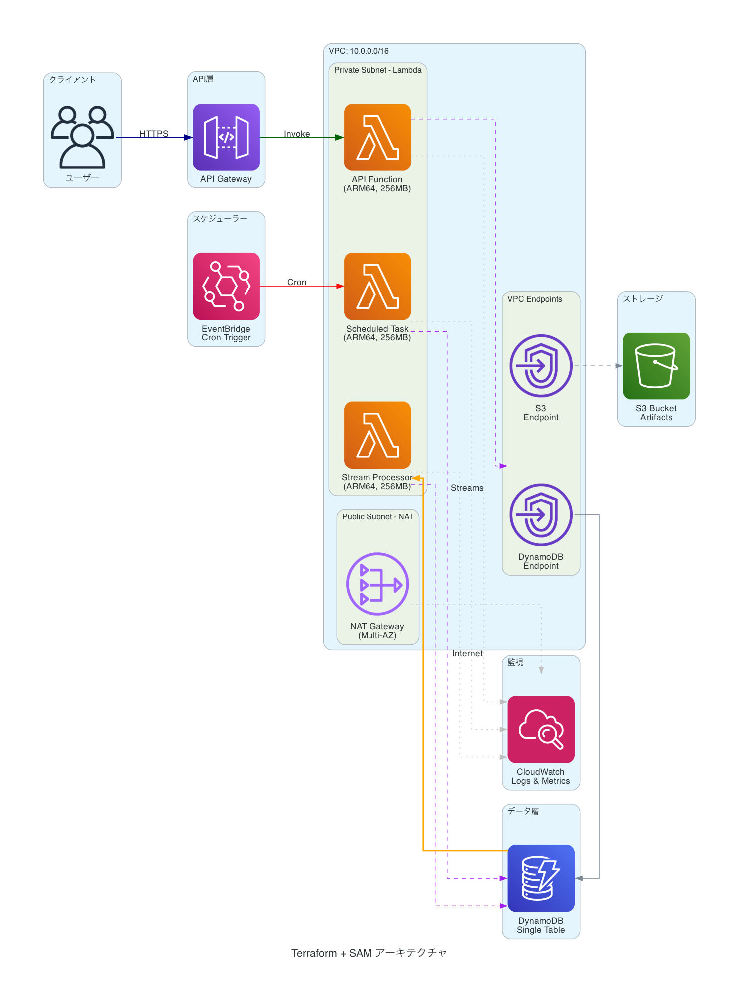
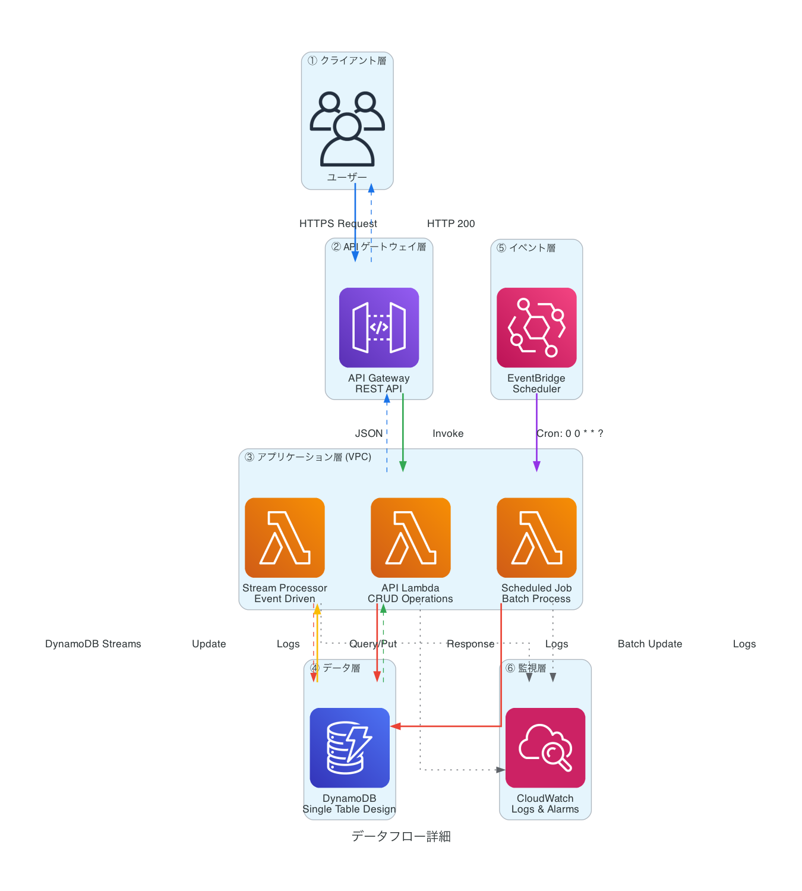
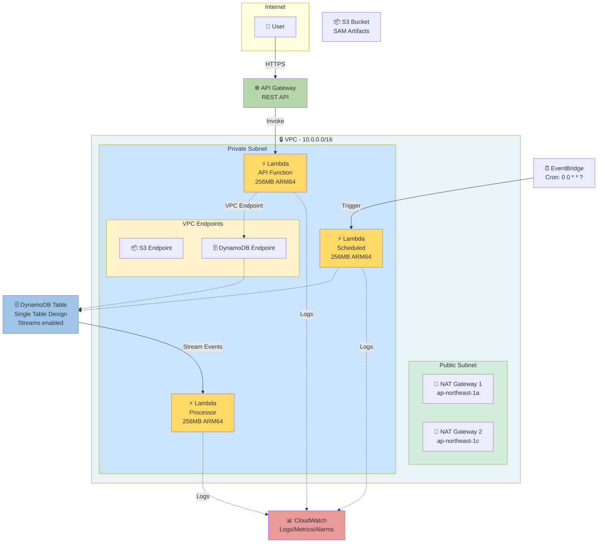

# Terraform + AWS SAM 完全ガイド - 実践プロジェクト

TerraformとAWS SAM（Serverless Application Model）を組み合わせて、エンタープライズグレードのサーバーレスアプリケーションを構築する完全なサンプルプロジェクトです。

## 📋 目次

- [アーキテクチャ概要](#アーキテクチャ概要)
- [前提条件](#前提条件)
- [プロジェクト構成](#プロジェクト構成)
- [セットアップ](#セットアップ)
- [デプロイ手順](#デプロイ手順)
- [トラブルシューティング](#トラブルシューティング)
- [ベストプラクティス](#ベストプラクティス)

## 🏗️ アーキテクチャ概要

### アーキテクチャ図

**AWS公式アイコンを使った図:**

#### シンプル版


#### 詳細版


#### データフロー詳細


<details>
<summary>📊 Mermaid図版（クリックで展開）</summary>



</details>

**凡例:**
- 🔒 **VPC**: セキュアなプライベートネットワーク
- ⚡ **Lambda**: サーバーレス関数（ARM64 Graviton2）
- 🗄️ **DynamoDB**: NoSQLデータベース（Single Table Design）
- 📊 **CloudWatch**: 統合監視サービス
- 🔄 **NAT Gateway**: Lambda → Internet 接続用

> **📊 詳細な編集可能な図**: [docs/architecture.drawio](docs/architecture.drawio) をVS Codeで開いて確認・編集できます

このプロジェクトは以下のような責務分離を実現しています：

### Terraform が管理するもの
- **インフラストラクチャ基盤**
  - VPC、サブネット、セキュリティグループ
  - S3バケット（SAMアーティファクト用）
  - DynamoDB テーブル
  - IAM ロール・ポリシー
  - CloudWatch Logs グループ

### SAM が管理するもの
- **アプリケーションロジック**
  - Lambda 関数
  - API Gateway
  - Lambda レイヤー
  - イベントソース（EventBridge、DynamoDB Streams等）

### システム構成

```
Internet → API Gateway
              ↓
         ┌─── VPC ───┐
         │ Lambda x3  │
         │ VPC EP     │
         └─────┬──────┘
               ↓
           DynamoDB
               ↓
           CloudWatch
```

詳細は [docs/architecture.md](docs/architecture.md) を参照してください。

## 📦 前提条件

### 必須ツール
- **Terraform** >= 1.5.0
- **AWS CLI** >= 2.0
- **AWS SAM CLI** >= 1.100.0
- **Python** >= 3.11
- **Docker** （ローカルテストに必要）

### AWS認証情報
```bash
aws configure
# または
export AWS_PROFILE=your-profile
```

### インストール確認
```bash
terraform --version
sam --version
aws --version
python3 --version
```

## 📁 プロジェクト構成

```
terraform-sam-demo/
├── terraform/                  # Terraformコード
│   ├── main.tf                 # メインエントリポイント
│   ├── variables.tf            # 変数定義
│   ├── outputs.tf              # 出力値（SAMで使用）
│   ├── iam.tf                  # IAMロール・ポリシー
│   ├── s3.tf                   # S3バケット
│   ├── vpc.tf                  # VPC設定
│   ├── dynamodb.tf             # DynamoDBテーブル
│   ├── cloudwatch.tf           # CloudWatch設定
│   ├── backend.tf              # Terraform State管理
│   └── environments/           # 環境別設定
│       ├── dev.tfvars
│       ├── staging.tfvars
│       └── prod.tfvars
├── sam/                        # SAMアプリケーション
│   ├── template.yaml           # SAMテンプレート
│   ├── functions/              # Lambda関数
│   │   ├── api/                # API Lambda
│   │   └── processor/          # バッチ処理Lambda
│   ├── layers/                 # Lambda レイヤー
│   │   └── common/
│   └── events/                 # テストイベント
├── scripts/                    # デプロイスクリプト
├── .github/workflows/          # CI/CD設定
└── docs/                       # ドキュメント
```

## 🚀 セットアップ

### 1. リポジトリのクローン
```bash
git clone <your-repo>
cd terraform-sam-demo
```

### 2. Terraform インフラストラクチャのデプロイ

```bash
cd terraform

# 初期化
terraform init

# プランの確認（dev環境の例）
terraform plan -var-file=environments/dev.tfvars

# 適用
terraform apply -var-file=environments/dev.tfvars

# 出力値を保存（SAMで使用）
terraform output -json > ../sam/terraform-outputs.json
```

### 3. SAM アプリケーションのデプロイ

```bash
cd ../sam

# ビルド
sam build

# ローカルテスト（オプション）
sam local start-api

# デプロイ
sam deploy \
  --stack-name my-app-dev \
  --s3-bucket $(cat terraform-outputs.json | jq -r '.sam_artifacts_bucket.value') \
  --capabilities CAPABILITY_IAM \
  --parameter-overrides \
    Environment=dev \
    VpcId=$(cat terraform-outputs.json | jq -r '.vpc_id.value') \
    SubnetIds=$(cat terraform-outputs.json | jq -r '.private_subnet_ids.value | join(",")') \
    SecurityGroupId=$(cat terraform-outputs.json | jq -r '.lambda_security_group_id.value') \
    DynamoDBTableName=$(cat terraform-outputs.json | jq -r '.dynamodb_table_name.value')
```

### 4. デプロイスクリプトを使う（推奨）

```bash
# 全自動デプロイ
./scripts/deploy.sh dev

# 検証のみ
./scripts/validate.sh dev
```

## 🔍 デプロイ手順（詳細）

### 環境別デプロイ

#### Development 環境
```bash
./scripts/deploy.sh dev
```

#### Staging 環境
```bash
./scripts/deploy.sh staging
```

#### Production 環境
```bash
./scripts/deploy.sh prod
```

### ローカルテスト

```bash
cd sam

# API をローカルで起動
sam local start-api --parameter-overrides ParameterKey=Environment,ParameterValue=dev

# 特定の関数を実行
sam local invoke ApiFunction -e events/event.json

# Lambda レイヤーを含めてビルド
sam build --use-container
```

## 🐛 トラブルシューティング

### よくあるエラーと解決方法

#### 1. `ROLLBACK_IN_PROGRESS` エラー
```
原因: IAMロールの権限不足、リソース名の重複など

解決方法:
1. CloudFormation コンソールでエラー詳細を確認
2. スタックを削除して再デプロイ
   aws cloudformation delete-stack --stack-name my-app-dev
3. IAM ロールのポリシーを確認
```

#### 2. VPC Lambda のタイムアウト
```
原因: NAT Gateway未設定、セキュリティグループの設定ミス

解決方法:
1. NAT Gateway がパブリックサブネットに存在するか確認
2. ルートテーブルが正しく設定されているか確認
3. セキュリティグループで HTTPS (443) が許可されているか確認
```

#### 3. SAM ビルドエラー
```
原因: 依存パッケージのインストール失敗

解決方法:
1. Docker が起動しているか確認
2. --use-container オプションを使用
   sam build --use-container
3. requirements.txt の内容を確認
```

#### 4. Terraform State ロック
```
原因: 前回の実行が異常終了した

解決方法:
terraform force-unlock <LOCK_ID>
```

## 💡 ベストプラクティス

### 1. IAM 権限の最小化
- Lambda に必要最小限の権限のみ付与
- Resource を `*` にしない
- Condition を活用

### 2. セキュリティ
- シークレットは AWS Secrets Manager を使用
- VPC Lambda は private subnet に配置
- API Gateway には認証を設定

### 3. コスト最適化
- Lambda メモリサイズを適切に設定
- DynamoDB は On-Demand から検討
- CloudWatch Logs の保持期間を設定

### 4. モニタリング
- CloudWatch Alarms を設定
- X-Ray トレーシングを有効化
- Lambda Insights を活用

### 5. CI/CD
- 環境ごとに GitHub Actions ワークフローを分離
- terraform plan を PR でレビュー
- 本番デプロイは承認フローを追加

## 📊 コスト見積もり

### 最小構成（dev環境）
- Lambda: 100万リクエスト/月 = $0.20
- API Gateway: 100万リクエスト/月 = $3.50
- DynamoDB On-Demand: 100万読み取り = $0.25
- NAT Gateway: 1個 = $32.40
- **合計: 約 $36/月**

### 本番環境（想定）
- 使用量により変動
- NAT Gateway が大きな割合を占める
- PrivateLink や VPC Endpoint で削減可能

## 🔗 関連リンク

- [Terraform AWS Provider](https://registry.terraform.io/providers/hashicorp/aws/latest/docs)
- [AWS SAM Documentation](https://docs.aws.amazon.com/serverless-application-model/)
- [AWS Lambda Best Practices](https://docs.aws.amazon.com/lambda/latest/dg/best-practices.html)

## 📝 ライセンス

MIT License

## 👤 作成者

Qiita Article: https://qiita.com/keitah/items/bcc98499410b9d4a684c
