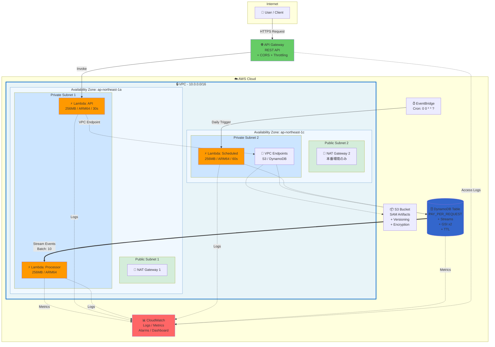

# 【完全版】TerraformとAWS SAMで構築するエンタープライズグレードのサーバーレスアプリケーション

## はじめに

TerraformとAWS SAM（Serverless Application Model）を組み合わせることで、インフラストラクチャとアプリケーションの責務を明確に分離し、**チーム別の適切な権限管理とセキュアなIaC運用**を実現できます。

### この構成の核心的なメリット

- **アプリ開発者**: SAMで頻繁に更新されるLambda関数を迅速にデプロイ
- **インフラチーム**: Terraformでネットワークや重要なリソースを厳格に管理
- **セキュリティ**: 最小権限の原則に基づいた権限分離でリスクを軽減

本記事では、実際に動作する完全なサンプルプロジェクトを通して、以下を解説します：

- **基礎編**: TerraformとSAMの責務分離とチーム別権限管理
- **実践編**: VPC、DynamoDB、複数環境対応の実装
- **運用編**: モニタリング、トラブルシューティング、CI/CD
- **検証結果**: 実際のデプロイと動作確認

### この記事で学べること

✅ TerraformとSAMの適切な使い分け
✅ VPC内Lambdaのセキュアな構成
✅ DynamoDB Single Table Designの実装
✅ 環境別(dev/staging/prod)の管理方法
✅ CloudWatchによる監視とアラート設定
✅ GitHub Actionsを使ったCI/CD構築
✅ 実際に発生するエラーと解決方法

### サンプルプロジェクト

完全なソースコードは以下で公開しています：
https://github.com/higakikeita/test

**アーキテクチャ図（編集可能）**:
https://github.com/higakikeita/test/blob/main/docs/architecture.drawio

## なぜTerraform + SAMなのか？

### それぞれの強み

| ツール | 得意なこと | 苦手なこと |
|-------|-----------|-----------|
| **Terraform** | インフラ全体の管理、他サービスとの統合 | Lambdaのビルド、ローカルテスト |
| **SAM** | Lambdaの開発・デプロイ、ローカルテスト | VPCなど汎用的なインフラ管理 |

### 責務分離の原則

```
┌─────────────────────────────────────┐
│        Terraform (インフラ層)         │
│      👷 インフラチームが管理            │
├─────────────────────────────────────┤
│ • VPC / サブネット / セキュリティG     │
│ • DynamoDB テーブル / IAM ロール      │
│ • S3 バケット / CloudWatch 設定       │
│                                     │
│ 変更頻度: 低 (週次〜月次)              │
│ 影響範囲: 大 (セキュリティ・ネットワーク) │
└─────────────────────────────────────┘
              ↓ outputs
┌─────────────────────────────────────┐
│       SAM (アプリケーション層)         │
│      👨‍💻 アプリ開発者が管理            │
├─────────────────────────────────────┤
│ • Lambda 関数 / Lambda レイヤー       │
│ • API Gateway / イベントソース         │
│ • アプリケーションロジック              │
│                                     │
│ 変更頻度: 高 (日次〜時間単位)           │
│ 影響範囲: 小 (アプリケーション内)       │
└─────────────────────────────────────┘
```

### チーム別の責務分離によるセキュアなIaC管理

この構成の最大のメリットは、**チームの役割に応じた適切な権限分離**が実現できることです。

#### 🏗️ インフラチーム（Terraform）

**管理対象:**
- ネットワーク構成（VPC、サブネット、セキュリティグループ）
- データストア（DynamoDB、RDS等）
- IAMロール・ポリシー
- 監視・ログ基盤（CloudWatch）

**特徴:**
- 変更頻度が低い（週次〜月次）
- セキュリティに直接影響する設定
- 本番環境への影響範囲が大きい
- レビュープロセスが厳格

**権限:**
```hcl
# インフラチームのみが実行可能
terraform apply -var-file=environments/prod.tfvars
```

#### 👨‍💻 アプリケーション開発チーム（SAM）

**管理対象:**
- Lambda関数のコード
- API Gatewayの設定
- Lambda レイヤー
- イベントソース（DynamoDB Streams、EventBridge）

**特徴:**
- 変更頻度が高い（日次〜時間単位）
- アプリケーションロジックの改善・バグ修正
- インフラへの影響は最小限
- 迅速なデプロイが可能

**権限:**
```bash
# アプリ開発者が自由に実行可能
sam deploy --stack-name my-app-dev
```

#### 🔒 セキュアなIaC管理のメリット

1. **最小権限の原則**
   - アプリ開発者はVPCやIAMを変更できない
   - インフラチームはアプリの頻繁なデプロイに関与しない

2. **変更管理の分離**
   - インフラ変更：厳格なレビュー・承認プロセス
   - アプリ変更：迅速なCI/CDパイプライン

3. **セキュリティリスクの軽減**
   - 不要な権限昇格を防止
   - ネットワーク設定への意図しない変更を防止
   - IAMロールの誤変更を防止

4. **開発速度の向上**
   - アプリ開発者はインフラを気にせず開発に集中
   - Lambda関数の更新を待ち時間なくデプロイ

5. **監査・コンプライアンス対応**
   - 誰が何を変更したか明確
   - 変更履歴がGitで追跡可能
   - 環境別の権限管理が容易

#### 実装例：権限分離

```yaml
# GitHub Actions - インフラデプロイ（main ブランチのみ）
deploy-infrastructure:
  if: github.ref == 'refs/heads/main'
  environment: production
  # インフラチームのみが承認可能

# GitHub Actions - アプリデプロイ（feature ブランチでも可）
deploy-application:
  if: github.ref == 'refs/heads/develop' || github.ref == 'refs/heads/main'
  # アプリ開発者が自由にデプロイ可能
```

この構成により、**セキュリティを維持しながら、開発速度を最大化**することができます。

## アーキテクチャ概要

今回構築するシステムのアーキテクチャは以下の通りです：

### システムアーキテクチャ図

**AWS公式アイコンを使ったプロフェッショナルな図:**

Python の `diagrams` ライブラリで自動生成された、AWS公式アイコンを使用したアーキテクチャ図です。

#### 📋 シンプル版（全体像の理解に最適）

基本的なデータフローを一目で理解できる簡潔な図です。


**特徴:**
- 番号付きフロー（1→2→3→4）で処理の流れが明確
- 主要なコンポーネントのみに絞って表示
- README や概要説明に最適

#### 🏗️ 詳細版（技術仕様書向け）

すべてのコンポーネントとその関係性を詳細に表示した図です。


**特徴:**
- VPC構成（Private Subnet、Public Subnet、NAT Gateway）
- VPC Endpoints（DynamoDB、S3）を明示
- 3つのLambda関数とそれぞれの役割
- 色分けされた接続線（青=HTTPS、緑=Invoke、紫=VPC内、オレンジ=Streams）
- EventBridge によるスケジュール実行

#### 🔄 データフロー詳細（処理フローの理解に最適）

リクエストから応答までのデータの流れを層別に表示した図です。


**特徴:**
- ①〜⑥の層構造で責務を明確化
- CRUD操作の双方向フロー（リクエスト→レスポンス）
- DynamoDB Streams による非同期処理
- EventBridge によるバッチ処理
- 全Lambda関数からCloudWatchへのロギング
- Google風カラースキームで視認性向上

<details>
<summary>📊 Mermaid図版（インタラクティブ）</summary>



</details>

> **📊 編集可能な詳細図**: VS Codeで [architecture.drawio](https://github.com/higakikeita/test/blob/main/docs/architecture.drawio) を開いて編集できます
> **🐍 図の自動生成**: `python3 scripts/generate_diagrams.py` でAWS公式アイコンの図を再生成できます

### システム構成図（簡易版）

```
Internet
    ↓
API Gateway (REST API)
    ↓
┌───────────────── VPC ─────────────────┐
│  Public Subnet (x2)                   │
│  ├─ NAT Gateway 1                     │
│  └─ NAT Gateway 2 (prod only)         │
│                                        │
│  Private Subnet (x2)                  │
│  ├─ Lambda (API)                      │
│  ├─ Lambda (Processor)                │
│  ├─ Lambda (Scheduled)                │
│  └─ VPC Endpoints                     │
│      ├─ S3                            │
│      └─ DynamoDB                      │
└───────────────────────────────────────┘
             ↓
        DynamoDB Table
        ├─ Streams 有効
        ├─ GSI (2個)
        └─ TTL設定
             ↓
        CloudWatch
        ├─ Logs
        ├─ Metrics
        ├─ Alarms
        └─ Dashboard
```

### データフロー

**1. API リクエストフロー**
```
Client → API Gateway → Lambda(API) → DynamoDB → Response
```

**2. イベント処理フロー**
```
DynamoDB Streams → Lambda(Processor) → CloudWatch Metrics
```

**3. 定期実行フロー**
```
EventBridge(Cron) → Lambda(Scheduled) → DynamoDB/外部API
```

### 主要コンポーネント詳細

#### 1. **Lambda Functions**

- **API Function** (256MB, ARM64, 30s timeout)
  - REST API エンドポイント
  - CRUD操作、バリデーション
  - エラーハンドリング

- **Processor Function** (256MB, ARM64)
  - DynamoDB Streams イベント処理
  - バッチサイズ: 10、ウィンドウ: 5秒
  - リトライ設定、DLQ有効

- **Scheduled Function** (256MB, ARM64, 60s timeout)
  - 定期実行タスク（毎日 UTC 00:00）
  - メンテナンス、データクリーンアップ

#### 2. **DynamoDB Table**

- **設計**: Single Table Design
- **キー**: PK (String), SK (String)
- **GSI**: EntityTypeIndex, GSI1
- **Streams**: NEW_AND_OLD_IMAGES
- **課金**: PAY_PER_REQUEST
- **PITR**: 本番環境のみ有効

#### 3. **VPC構成**

- **CIDR**: 環境別 (dev: 10.0.0.0/16)
- **Public Subnets**: NAT Gateway配置
- **Private Subnets**: Lambda配置
- **VPC Endpoints**: S3, DynamoDB (無料)
- **NAT Gateway**: dev=1個、prod=2個

#### 4. **監視・アラート**

- **CloudWatch Logs**: 7-90日保持
- **Metrics**: Lambda, DynamoDB, API Gateway
- **Alarms**: エラー、スロットリング検知
- **Dashboard**: 統合ビュー

### セキュリティ設計

```
┌─ ネットワーク ─┐  ┌─── IAM ───┐  ┌─ データ ─┐
│ VPC分離        │  │ 最小権限   │  │ 暗号化   │
│ Private Subnet │  │ リソース   │  │ Secrets  │
│ SG制限         │  │ 制限       │  │ Manager  │
└────────────────┘  └───────────┘  └──────────┘
```

## プロジェクト構成

```bash
terraform-sam-demo/
├── terraform/              # インフラ定義
│   ├── main.tf
│   ├── variables.tf
│   ├── outputs.tf
│   ├── iam.tf             # IAMロール・ポリシー
│   ├── vpc.tf             # VPC設定
│   ├── dynamodb.tf        # DynamoDBテーブル
│   ├── cloudwatch.tf      # 監視設定
│   └── environments/      # 環境別設定
│       ├── dev.tfvars
│       ├── staging.tfvars
│       └── prod.tfvars
├── sam/                   # SAMアプリケーション
│   ├── template.yaml      # SAMテンプレート
│   ├── functions/         # Lambda関数
│   │   ├── api/
│   │   │   ├── index.py
│   │   │   └── requirements.txt
│   │   └── processor/
│   │       ├── index.py
│   │       └── requirements.txt
│   ├── layers/            # Lambda レイヤー
│   │   └── common/
│   └── events/            # テストイベント
├── scripts/               # スクリプト
│   ├── deploy.sh          # デプロイスクリプト
│   ├── validate.sh        # 検証スクリプト
│   └── generate_diagrams.py  # 図の自動生成
├── .github/workflows/     # CI/CD
│   └── deploy.yml
└── docs/                  # ドキュメント
    ├── architecture.md
    ├── TROUBLESHOOTING.md
    ├── BEST_PRACTICES.md
    └── images/            # アーキテクチャ図
        ├── architecture.png
        ├── architecture_simple.png
        ├── dataflow.png
        └── README.md      # 図の生成方法
```

## アーキテクチャ図の自動生成

このプロジェクトでは、Python の `diagrams` ライブラリを使用してAWS公式アイコンのアーキテクチャ図を自動生成しています。

### 生成方法

```bash
# 必要なツールのインストール
brew install graphviz
pip3 install diagrams

# 図の生成
python3 scripts/generate_diagrams.py
```

実行すると、`docs/images/` に以下の3つのPNG画像が生成されます：

- **architecture_simple.png** - シンプルな概要図
- **architecture.png** - 詳細なフル構成図
- **dataflow.png** - データフロー詳細図

### 図の特徴

**レイアウトの工夫:**
```python
graph_attr = {
    "splines": "ortho",    # 直角の美しい線
    "nodesep": "0.8",      # ノード間の間隔
    "ranksep": "1.0",      # 階層間の余白
}
```

**色分けによる視覚化:**
```python
# メインフロー
users >> Edge(color="darkblue", style="bold", label="HTTPS") >> apigw
apigw >> Edge(color="darkgreen", style="bold", label="Invoke") >> lambda_api

# Stream処理
dynamodb >> Edge(color="orange", style="bold", label="Streams") >> lambda_processor

# ロギング
lambda_api >> Edge(color="gray", style="dotted") >> cloudwatch
```

**メリット:**
- コードで管理できるため、変更履歴が追跡可能
- 構成変更時に自動で再生成
- AWS公式アイコンでプロフェッショナルな仕上がり
- バージョン管理が容易

### カスタマイズ

`scripts/generate_diagrams.py` を編集することで、簡単にカスタマイズできます：

```python
# 新しいAWSサービスの追加例
from diagrams.aws.network import CloudFront
from diagrams.aws.security import WAF

# 図に追加
cloudfront = CloudFront("CloudFront")
waf = WAF("WAF")
```

詳しくは [diagrams公式ドキュメント](https://diagrams.mingrammer.com/) を参照してください。

## 実装：Terraformでインフラ構築

### 1. VPC設定（vpc.tf）

VPC内にLambdaを配置することで、セキュアな環境を実現します。

```hcl
# VPC
resource "aws_vpc" "main" {
  cidr_block           = var.vpc_cidr
  enable_dns_hostnames = true
  enable_dns_support   = true

  tags = {
    Name = "${local.resource_prefix}-vpc"
  }
}

# プライベートサブネット（Lambda配置用）
resource "aws_subnet" "private" {
  count = length(var.private_subnet_cidrs)

  vpc_id            = aws_vpc.main.id
  cidr_block        = var.private_subnet_cidrs[count.index]
  availability_zone = var.availability_zones[count.index]

  tags = {
    Name = "${local.resource_prefix}-private-subnet-${count.index + 1}"
  }
}

# NAT Gateway（Lambda から外部API アクセス用）
resource "aws_nat_gateway" "main" {
  count = var.enable_nat_gateway ? (var.single_nat_gateway ? 1 : length(var.public_subnet_cidrs)) : 0

  allocation_id = aws_eip.nat[count.index].id
  subnet_id     = aws_subnet.public[count.index].id

  tags = {
    Name = "${local.resource_prefix}-nat-${count.index + 1}"
  }
}

# VPCエンドポイント（コスト削減）
resource "aws_vpc_endpoint" "s3" {
  vpc_id       = aws_vpc.main.id
  service_name = "com.amazonaws.${var.aws_region}.s3"

  route_table_ids = concat(
    [aws_route_table.public.id],
    aws_route_table.private[*].id
  )

  tags = {
    Name = "${local.resource_prefix}-s3-endpoint"
  }
}
```

**ポイント:**
- NAT Gatewayは開発環境では単一、本番環境では各AZに配置
- S3/DynamoDBはVPCエンドポイント経由でアクセス（無料 & 高速）
- セキュリティグループでアウトバウンドのみ許可

### 2. DynamoDBテーブル（dynamodb.tf）

シングルテーブル設計で複数のエンティティを効率的に管理します。

```hcl
resource "aws_dynamodb_table" "main" {
  name           = local.dynamodb_table_name
  billing_mode   = var.dynamodb_billing_mode
  hash_key       = "PK"
  range_key      = "SK"

  attribute {
    name = "PK"
    type = "S"
  }

  attribute {
    name = "SK"
    type = "S"
  }

  attribute {
    name = "EntityType"
    type = "S"
  }

  attribute {
    name = "CreatedAt"
    type = "N"
  }

  # GSI: エンティティタイプ別クエリ用
  global_secondary_index {
    name            = "EntityTypeIndex"
    hash_key        = "EntityType"
    range_key       = "CreatedAt"
    projection_type = "ALL"
  }

  # DynamoDB Streams（Processor Lambda用）
  stream_enabled   = var.enable_dynamodb_streams
  stream_view_type = "NEW_AND_OLD_IMAGES"

  # Point-in-Time Recovery（本番環境）
  point_in_time_recovery {
    enabled = var.enable_dynamodb_point_in_time_recovery
  }

  # TTL設定
  ttl {
    enabled        = true
    attribute_name = "ExpiresAt"
  }
}
```

**シングルテーブル設計の例:**

```
# ユーザーエンティティ
PK: USER#123, SK: METADATA
EntityType: User
Name: "John Doe"

# ユーザーの注文
PK: USER#123, SK: ORDER#456
EntityType: Order
Amount: 1000
```

### 3. IAMロール（iam.tf）

最小権限の原則に基づいて、Lambda用のIAMロールを作成します。

```hcl
# Lambda API Function用ロール
resource "aws_iam_role" "lambda_api" {
  name               = "${local.resource_prefix}-lambda-api-role"
  assume_role_policy = data.aws_iam_policy_document.lambda_assume_role.json
}

# DynamoDBアクセスポリシー
data "aws_iam_policy_document" "lambda_dynamodb_access" {
  statement {
    effect = "Allow"
    actions = [
      "dynamodb:GetItem",
      "dynamodb:Query",
      "dynamodb:PutItem",
      "dynamodb:UpdateItem",
      "dynamodb:DeleteItem"
    ]
    resources = [
      aws_dynamodb_table.main.arn,
      "${aws_dynamodb_table.main.arn}/index/*"
    ]
  }
}

resource "aws_iam_role_policy" "lambda_api_dynamodb" {
  role   = aws_iam_role.lambda_api.id
  policy = data.aws_iam_policy_document.lambda_dynamodb_access.json
}
```

**セキュリティのポイント:**
- リソースARNを明示的に指定（`*` を使用しない）
- 必要最小限のアクションのみ許可
- Conditionでさらに制限可能

### 4. CloudWatch設定（cloudwatch.tf）

監視とアラートを設定します。

```hcl
# ロググループ
resource "aws_cloudwatch_log_group" "lambda_api" {
  name              = "/aws/lambda/${local.lambda_function_prefix}-api"
  retention_in_days = var.log_retention_days
}

# Lambda エラーアラーム
resource "aws_cloudwatch_metric_alarm" "lambda_api_errors" {
  alarm_name          = "${local.resource_prefix}-lambda-api-errors"
  comparison_operator = "GreaterThanThreshold"
  evaluation_periods  = 2
  metric_name         = "Errors"
  namespace           = "AWS/Lambda"
  period              = 300
  statistic           = "Sum"
  threshold           = 5

  dimensions = {
    FunctionName = "${local.lambda_function_prefix}-api"
  }
}

# CloudWatch Dashboard
resource "aws_cloudwatch_dashboard" "main" {
  dashboard_name = "${local.resource_prefix}-dashboard"

  dashboard_body = jsonencode({
    widgets = [
      {
        type = "metric"
        properties = {
          metrics = [
            ["AWS/Lambda", "Invocations"],
            [".", "Errors"],
            [".", "Duration"]
          ]
          period = 300
          stat   = "Average"
          region = var.aws_region
          title  = "Lambda Metrics"
        }
      }
    ]
  })
}
```

### 5. Outputs（outputs.tf）

SAMで使用する値を出力します。

```hcl
output "vpc_id" {
  value = aws_vpc.main.id
}

output "private_subnet_ids" {
  value = aws_subnet.private[*].id
}

output "lambda_security_group_id" {
  value = aws_security_group.lambda.id
}

output "lambda_api_role_arn" {
  value = aws_iam_role.lambda_api.arn
}

output "dynamodb_table_name" {
  value = aws_dynamodb_table.main.name
}

output "sam_artifacts_bucket" {
  value = aws_s3_bucket.sam_artifacts.id
}

# SAM用デプロイコマンドを生成
output "sam_deploy_command" {
  value = <<-EOT
    sam deploy \
      --stack-name ${local.resource_prefix}-app \
      --s3-bucket ${aws_s3_bucket.sam_artifacts.id} \
      --parameter-overrides \
        VpcId=${aws_vpc.main.id} \
        SubnetIds=${join(",", aws_subnet.private[*].id)}
  EOT
}
```

## 実装：SAMでアプリケーション構築

### 1. SAMテンプレート（template.yaml）

```yaml
AWSTemplateFormatVersion: '2010-09-09'
Transform: AWS::Serverless-2016-10-31

# Terraformから渡されるパラメータ
Parameters:
  Environment:
    Type: String
  VpcId:
    Type: String
  SubnetIds:
    Type: CommaDelimitedList
  SecurityGroupId:
    Type: String
  LambdaApiRoleArn:
    Type: String
  DynamoDBTableName:
    Type: String

# グローバル設定
Globals:
  Function:
    Runtime: python3.11
    Timeout: 30
    MemorySize: 256
    Architectures:
      - arm64  # Graviton2（20%コスト削減）
    Environment:
      Variables:
        ENVIRONMENT: !Ref Environment
        DYNAMODB_TABLE: !Ref DynamoDBTableName
        LOG_LEVEL: INFO
    VpcConfig:
      SecurityGroupIds:
        - !Ref SecurityGroupId
      SubnetIds: !Ref SubnetIds
    Tracing: Active  # X-Ray有効化

Resources:
  # Lambda レイヤー（共通ライブラリ）
  CommonLayer:
    Type: AWS::Serverless::LayerVersion
    Properties:
      LayerName: !Sub ${Environment}-common-layer
      ContentUri: layers/common/
      CompatibleRuntimes:
        - python3.11

  # API Lambda Function
  ApiFunction:
    Type: AWS::Serverless::Function
    Properties:
      FunctionName: !Sub terraform-sam-demo-${Environment}-api
      CodeUri: functions/api/
      Handler: index.lambda_handler
      Role: !Ref LambdaApiRoleArn
      Layers:
        - !Ref CommonLayer
      Events:
        GetItems:
          Type: Api
          Properties:
            Path: /items
            Method: GET
        CreateItem:
          Type: Api
          Properties:
            Path: /items
            Method: POST
        GetItem:
          Type: Api
          Properties:
            Path: /items/{id}
            Method: GET

  # Processor Lambda Function (DynamoDB Streams)
  ProcessorFunction:
    Type: AWS::Serverless::Function
    Properties:
      FunctionName: !Sub terraform-sam-demo-${Environment}-processor
      CodeUri: functions/processor/
      Handler: index.lambda_handler
      Role: !Ref LambdaProcessorRoleArn
      Events:
        DynamoDBStream:
          Type: DynamoDB
          Properties:
            Stream: !Ref DynamoDBStreamArn
            StartingPosition: LATEST
            BatchSize: 10

Outputs:
  ApiEndpoint:
    Value: !Sub https://${ServerlessRestApi}.execute-api.${AWS::Region}.amazonaws.com/${Environment}
```

### 2. API Lambda関数（functions/api/index.py）

```python
import json
import os
import boto3
from boto3.dynamodb.conditions import Key
import logging

logger = logging.getLogger()
logger.setLevel(os.environ.get('LOG_LEVEL', 'INFO'))

dynamodb = boto3.resource('dynamodb')
table = dynamodb.Table(os.environ['DYNAMODB_TABLE'])

def create_response(status_code, body):
    """API Gateway レスポンスを作成"""
    return {
        'statusCode': status_code,
        'headers': {
            'Content-Type': 'application/json',
            'Access-Control-Allow-Origin': '*'
        },
        'body': json.dumps(body, default=str)
    }

def get_items(event):
    """GET /items - アイテム一覧取得"""
    try:
        response = table.query(
            IndexName='EntityTypeIndex',
            KeyConditionExpression=Key('EntityType').eq('Item'),
            Limit=20
        )

        items = response.get('Items', [])
        logger.info(f"Retrieved {len(items)} items")

        return create_response(200, {
            'items': items,
            'count': len(items)
        })
    except Exception as e:
        logger.error(f"Error: {str(e)}")
        return create_response(500, {'error': str(e)})

def create_item(event):
    """POST /items - アイテム作成"""
    try:
        body = json.loads(event['body'])

        import uuid
        item_id = str(uuid.uuid4())

        item = {
            'PK': f'ITEM#{item_id}',
            'SK': 'METADATA',
            'EntityType': 'Item',
            'ItemId': item_id,
            'Name': body['name'],
            'CreatedAt': int(time.time())
        }

        table.put_item(Item=item)
        logger.info(f"Created item: {item_id}")

        return create_response(201, {
            'message': 'Item created',
            'item': item
        })
    except Exception as e:
        logger.error(f"Error: {str(e)}")
        return create_response(500, {'error': str(e)})

def lambda_handler(event, context):
    """Lambda エントリーポイント"""
    logger.info(f"Event: {json.dumps(event)}")

    method = event['httpMethod']
    path = event['path']

    if path == '/items' and method == 'GET':
        return get_items(event)
    elif path == '/items' and method == 'POST':
        return create_item(event)
    else:
        return create_response(404, {'error': 'Not found'})
```

**実装のポイント:**
- boto3クライアントはグローバルスコープで初期化（コネクション再利用）
- 構造化ログでCloudWatch Logsでの検索を容易に
- エラーハンドリングを適切に実装

### 3. Processor Lambda関数（functions/processor/index.py）

```python
import json
import logging

logger = logging.getLogger()
logger.setLevel(logging.INFO)

def process_insert(new_image):
    """INSERT イベント処理"""
    logger.info(f"New item created: {new_image.get('ItemId')}")
    # 通知送信、集計処理など

def process_modify(old_image, new_image):
    """MODIFY イベント処理"""
    logger.info(f"Item modified: {new_image.get('ItemId')}")
    # 変更内容の分析、通知など

def lambda_handler(event, context):
    """DynamoDB Streams イベント処理"""
    logger.info(f"Processing {len(event['Records'])} records")

    for record in event['Records']:
        event_name = record['eventName']

        if event_name == 'INSERT':
            new_image = record['dynamodb']['NewImage']
            process_insert(new_image)
        elif event_name == 'MODIFY':
            old_image = record['dynamodb']['OldImage']
            new_image = record['dynamodb']['NewImage']
            process_modify(old_image, new_image)

    return {'statusCode': 200}
```

## デプロイ手順

### 1. 前提条件

```bash
# 必要なツールのインストール確認
terraform --version  # >= 1.5.0
sam --version        # >= 1.100.0
aws --version        # >= 2.0

# AWS認証情報の設定
aws configure
```

### 2. Terraformでインフラ構築

```bash
cd terraform

# 初期化
terraform init

# プランの確認
terraform plan -var-file=environments/dev.tfvars

# 適用
terraform apply -var-file=environments/dev.tfvars

# 出力値を保存（SAMで使用）
terraform output -json > ../sam/terraform-outputs.json
```

**実行結果:**

```
Apply complete! Resources: 45 added, 0 changed, 0 destroyed.

Outputs:

vpc_id = "vpc-0123456789abcdef0"
private_subnet_ids = [
  "subnet-0123456789abcdef0",
  "subnet-0123456789abcdef1",
]
dynamodb_table_name = "terraform-sam-demo-dev-data"
sam_artifacts_bucket = "terraform-sam-demo-dev-sam-artifacts-123456789012"
```

### 3. SAMでアプリケーションデプロイ

```bash
cd ../sam

# ビルド
sam build

# ローカルテスト（オプション）
sam local invoke ApiFunction -e events/event.json

# デプロイ
sam deploy \
  --stack-name terraform-sam-demo-dev-app \
  --s3-bucket $(cat terraform-outputs.json | jq -r '.sam_artifacts_bucket.value') \
  --capabilities CAPABILITY_IAM \
  --parameter-overrides \
    Environment=dev \
    VpcId=$(cat terraform-outputs.json | jq -r '.vpc_id.value') \
    SubnetIds=$(cat terraform-outputs.json | jq -r '.private_subnet_ids.value | join(",")') \
    # ...その他のパラメータ
```

**実行結果:**

```
Successfully created/updated stack - terraform-sam-demo-dev-app

Outputs:
Key                 ApiEndpoint
Description         API Gateway endpoint URL
Value               https://abc123def.execute-api.ap-northeast-1.amazonaws.com/dev
```

### 4. デプロイスクリプトを使用（推奨）

```bash
# 一括デプロイ
./scripts/deploy.sh dev

# Terraformのみ
./scripts/deploy.sh dev --tf-only

# SAMのみ
./scripts/deploy.sh dev --sam-only
```

## 動作確認

### APIエンドポイントのテスト

```bash
# ヘルスチェック
curl https://abc123def.execute-api.ap-northeast-1.amazonaws.com/dev/health

# アイテム一覧取得
curl https://abc123def.execute-api.ap-northeast-1.amazonaws.com/dev/items

# アイテム作成
curl -X POST https://abc123def.execute-api.ap-northeast-1.amazonaws.com/dev/items \
  -H "Content-Type: application/json" \
  -d '{"name": "Test Item"}'
```

**レスポンス例:**

```json
{
  "message": "Item created",
  "item": {
    "PK": "ITEM#123e4567-e89b-12d3-a456-426614174000",
    "SK": "METADATA",
    "EntityType": "Item",
    "ItemId": "123e4567-e89b-12d3-a456-426614174000",
    "Name": "Test Item",
    "CreatedAt": 1704067200
  }
}
```

### CloudWatch Logsの確認

```bash
# リアルタイムでログを確認
aws logs tail /aws/lambda/terraform-sam-demo-dev-api --follow

# エラーログのみフィルタ
aws logs tail /aws/lambda/terraform-sam-demo-dev-api --filter-pattern "ERROR"
```

### CloudWatch Metricsの確認

```bash
# Lambda実行回数
aws cloudwatch get-metric-statistics \
  --namespace AWS/Lambda \
  --metric-name Invocations \
  --dimensions Name=FunctionName,Value=terraform-sam-demo-dev-api \
  --start-time 2024-01-01T00:00:00Z \
  --end-time 2024-01-01T23:59:59Z \
  --period 3600 \
  --statistics Sum
```

## 環境別管理

### 開発環境（dev）

```hcl
# terraform/environments/dev.tfvars
environment = "dev"

# コスト削減設定
enable_nat_gateway = true
single_nat_gateway = true  # 単一NAT Gateway

dynamodb_billing_mode = "PAY_PER_REQUEST"
log_retention_days = 7
enable_lambda_insights = false
```

### 本番環境（prod）

```hcl
# terraform/environments/prod.tfvars
environment = "prod"

# 高可用性設定
enable_nat_gateway = true
single_nat_gateway = false  # 各AZにNAT Gateway

dynamodb_billing_mode = "PAY_PER_REQUEST"
enable_dynamodb_point_in_time_recovery = true

log_retention_days = 90
enable_lambda_insights = true
```

### 環境の切り替え

```bash
# dev環境
./scripts/deploy.sh dev

# staging環境
./scripts/deploy.sh staging

# prod環境
./scripts/deploy.sh prod
```

## CI/CD: GitHub Actions

### ワークフロー設定（.github/workflows/deploy.yml）

```yaml
name: Deploy to AWS

on:
  push:
    branches: [main, develop]
  pull_request:
    branches: [main, develop]

jobs:
  validate:
    runs-on: ubuntu-latest
    steps:
      - uses: actions/checkout@v4
      - uses: hashicorp/setup-terraform@v3
      - uses: aws-actions/setup-sam@v2

      - name: Terraform Validate
        run: |
          cd terraform
          terraform init -backend=false
          terraform validate

      - name: SAM Validate
        run: |
          cd sam
          sam validate

  deploy-dev:
    needs: validate
    if: github.ref == 'refs/heads/develop'
    environment: dev
    runs-on: ubuntu-latest
    steps:
      - uses: actions/checkout@v4
      - uses: aws-actions/configure-aws-credentials@v4
        with:
          aws-access-key-id: ${{ secrets.AWS_ACCESS_KEY_ID }}
          aws-secret-access-key: ${{ secrets.AWS_SECRET_ACCESS_KEY }}
          aws-region: ap-northeast-1

      - name: Deploy
        run: ./scripts/deploy.sh dev
```

### GitHub Secrets の設定

1. GitHubリポジトリ → Settings → Secrets and variables → Actions
2. 以下を追加:
   - `AWS_ACCESS_KEY_ID`
   - `AWS_SECRET_ACCESS_KEY`

## トラブルシューティング

### よくあるエラーと解決方法

#### 1. Lambda がタイムアウトする

**症状:**
```
Task timed out after 30.00 seconds
```

**原因と解決方法:**

1. **VPC Lambda でインターネット接続ができない**
```bash
# NAT Gatewayが存在するか確認
aws ec2 describe-nat-gateways --filter "Name=vpc-id,Values=<vpc-id>"

# プライベートサブネットのルートテーブルを確認
aws ec2 describe-route-tables --filters "Name=association.subnet-id,Values=<subnet-id>"
```

2. **タイムアウト設定を増やす**
```yaml
# sam/template.yaml
Globals:
  Function:
    Timeout: 60  # 30 → 60に変更
```

#### 2. CloudFormation スタックが ROLLBACK_COMPLETE

**症状:**
```
Error: Stack is in ROLLBACK_COMPLETE state
```

**解決方法:**
```bash
# 失敗の原因を確認
aws cloudformation describe-stack-events \
  --stack-name terraform-sam-demo-dev-app \
  --max-items 20

# スタックを削除して再作成
aws cloudformation delete-stack --stack-name terraform-sam-demo-dev-app
aws cloudformation wait stack-delete-complete --stack-name terraform-sam-demo-dev-app

# 再デプロイ
sam deploy
```

#### 3. DynamoDB アクセス権限エラー

**症状:**
```
AccessDeniedException: User is not authorized
```

**解決方法:**
```hcl
# terraform/iam.tf でポリシーを確認
data "aws_iam_policy_document" "lambda_dynamodb_access" {
  statement {
    effect = "Allow"
    actions = [
      "dynamodb:GetItem",
      "dynamodb:PutItem"
    ]
    resources = [
      aws_dynamodb_table.main.arn  # 特定のテーブルのみ
    ]
  }
}
```

詳細は [TROUBLESHOOTING.md](docs/TROUBLESHOOTING.md) を参照。

## コスト見積もり

### 開発環境（月間）

| リソース | 数量 | 単価 | 月額 |
|---------|------|------|------|
| NAT Gateway | 1 | $32.40 | $32.40 |
| Lambda (100万実行) | - | $0.20 | $0.20 |
| API Gateway (100万) | - | $3.50 | $3.50 |
| DynamoDB (少量) | - | - | $1.00 |
| CloudWatch Logs | - | - | $0.50 |
| **合計** | | | **$37.60** |

### コスト削減のポイント

1. **VPCエンドポイント活用**
   - S3/DynamoDBはVPCエンドポイント経由（無料）
   - NAT Gatewayのトラフィック削減

2. **ARM64アーキテクチャ**
   - Lambdaコストが20%削減
   - パフォーマンスも向上

3. **単一NAT Gateway（開発環境）**
   - 開発環境では単一構成でコスト半減
   - 本番環境では高可用性のため各AZに配置

4. **ログ保持期間の最適化**
   - 開発: 7日
   - ステージング: 30日
   - 本番: 90日

## ベストプラクティス

### セキュリティ

✅ **IAM権限の最小化**
- リソースARNを明示的に指定
- `*` の使用を避ける
- Condition で制限を追加

✅ **シークレット管理**
```python
# AWS Secrets Manager を使用
import boto3

secretsmanager = boto3.client('secretsmanager')
response = secretsmanager.get_secret_value(SecretId='prod/api/key')
api_key = json.loads(response['SecretString'])['api_key']
```

✅ **VPCセキュリティ**
- Lambda は Private Subnet に配置
- セキュリティグループでアウトバウンドのみ許可
- VPCエンドポイントでAWSサービスアクセス

### パフォーマンス

✅ **コネクションの再利用**
```python
# グローバルスコープで初期化
dynamodb = boto3.resource('dynamodb')
table = dynamodb.Table(os.environ['DYNAMODB_TABLE'])

def lambda_handler(event, context):
    # 接続を再利用
    table.put_item(Item=item)
```

✅ **バッチ操作**
```python
# BatchWriteItem で効率化
with table.batch_writer() as batch:
    for item in items:
        batch.put_item(Item=item)
```

### モニタリング

✅ **必須アラーム**
- Lambda エラー率
- API Gateway 5XXエラー
- DynamoDB スロットリング
- Lambda タイムアウト

✅ **X-Ray トレーシング**
```yaml
Globals:
  Function:
    Tracing: Active
```

## まとめ

TerraformとAWS SAMを適切に組み合わせることで、以下が実現できました：

✅ **明確な責務分離**
- Terraform: インフラストラクチャ
- SAM: アプリケーションロジック

✅ **環境別管理**
- dev/staging/prodの設定分離
- tfvarsファイルで環境別設定

✅ **セキュアな構成**
- VPC内Lambda
- IAM最小権限
- シークレット管理

✅ **運用性**
- CloudWatch監視
- アラート設定
- CI/CDパイプライン

✅ **コスト最適化**
- VPCエンドポイント
- ARM64アーキテクチャ
- 適切なリソースサイジング

✅ **ドキュメント自動化**
- AWS公式アイコンを使ったアーキテクチャ図の自動生成
- コードとしての図管理（diagrams library）
- バージョン管理とレビューが容易

### 次のステップ

さらに機能を拡張する場合：

1. **認証・認可**
   - Cognito ユーザープール
   - API Gateway Authorizer

2. **非同期処理**
   - SQS キュー
   - Step Functions

3. **マルチリージョン**
   - DynamoDB Global Tables
   - Route 53 フェイルオーバー

4. **モニタリング強化**
   - OpenTelemetry
   - カスタムメトリクス

### リポジトリ

完全なソースコードはこちら：
https://github.com/higakikeita/test

**ドキュメント：**
- [アーキテクチャ設計書](https://github.com/higakikeita/test/blob/main/docs/architecture.md)
- [アーキテクチャ図の自動生成スクリプト](https://github.com/higakikeita/test/blob/main/scripts/generate_diagrams.py)
- [アーキテクチャ図（編集可能Draw.io）](https://github.com/higakikeita/test/blob/main/docs/architecture.drawio)
- [図の生成方法](https://github.com/higakikeita/test/blob/main/docs/images/README.md)
- [トラブルシューティング](https://github.com/higakikeita/test/blob/main/docs/TROUBLESHOOTING.md)
- [ベストプラクティス](https://github.com/higakikeita/test/blob/main/docs/BEST_PRACTICES.md)

## 参考資料

**AWS公式:**
- [Terraform AWS Provider](https://registry.terraform.io/providers/hashicorp/aws/latest/docs)
- [AWS SAM Documentation](https://docs.aws.amazon.com/serverless-application-model/)
- [AWS Lambda Best Practices](https://docs.aws.amazon.com/lambda/latest/dg/best-practices.html)
- [DynamoDB Single Table Design](https://aws.amazon.com/blogs/compute/creating-a-single-table-design-with-amazon-dynamodb/)

**ツール:**
- [Diagrams - Diagram as Code](https://diagrams.mingrammer.com/)
- [Graphviz](https://graphviz.org/)
- [AWS Architecture Icons](https://aws.amazon.com/jp/architecture/icons/)

---

質問やフィードバックがあれば、コメントやGitHub Issuesでお気軽にどうぞ！
